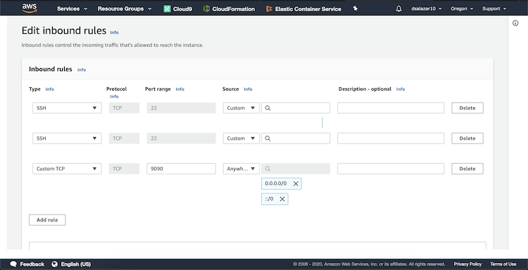
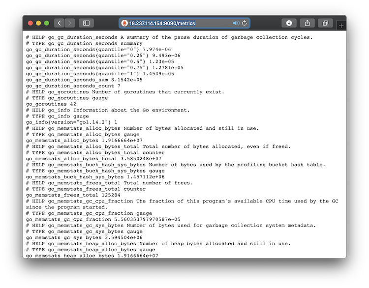
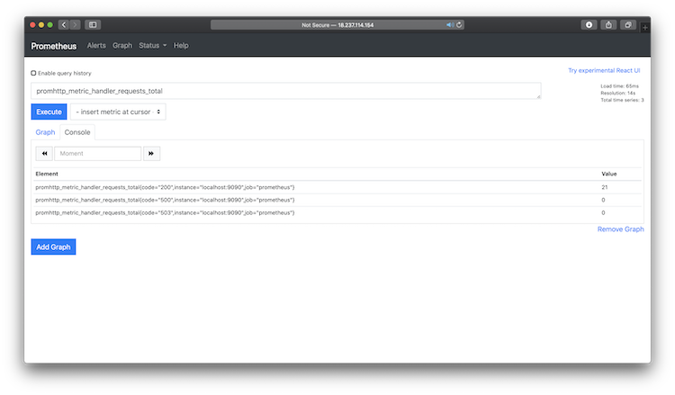
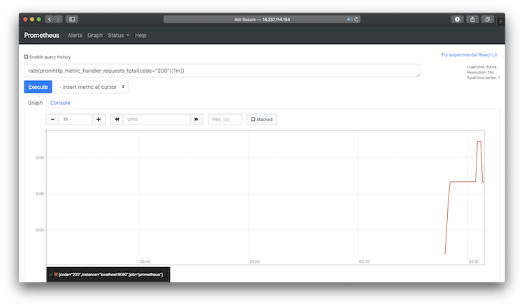
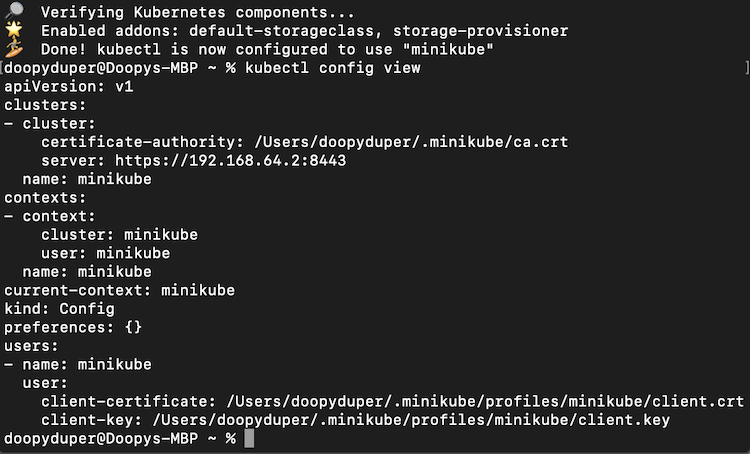

# Project-Kubernetes_Workflow
Udacity's Cloud DevOps Nanodegree Course 4 Project

1) Download Promethius

`wget https://github.com/prometheus/prometheus/releases/download/v2.18.1/prometheus-2.18.1.linux-amd64.tar.gz`

2) Unpack the tarball and change to the directory

`tar xvfz prometheus-*.tar.gz`

`cd prometheus-*`

3) Update the Promethius config file

4) Start Promethius

`./prometheus --config.file=prometheus.yml`

5) Update Cloud9's Security Group's inbound routing IP addresses to include port 9090 for all inbound traffic

6) View the metrics using /metrics

7) Execute graph commands using the Console Tab

8) Graph results using the Graph Tab

7) Configure and Run Kubernetes on local host

